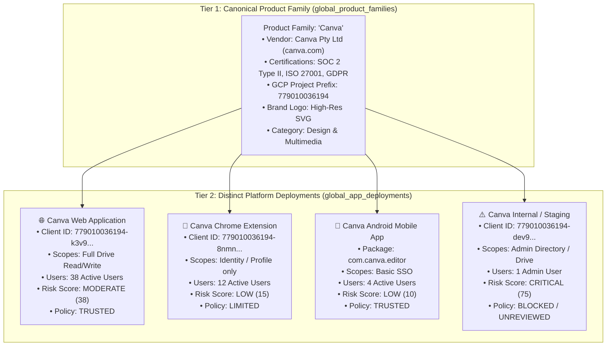
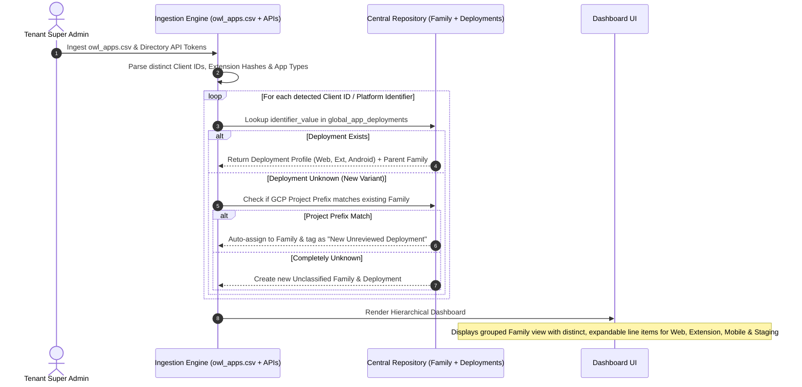

# AdminLens Central Application Repository Architecture

## Executive Summary

AdminLens utilizes a **Central Application Repository (Global Knowledge Base)** to deliver zero-latency onboarding, consistent application identity resolution, and crowdsourced SaaS threat intelligence across all Google Workspace tenants.

Crucially, AdminLens rejects the naive approach of blindly collapsing multiple OAuth Client IDs into an opaque single entry. Instead, AdminLens implements a **Hierarchical Product Family & Distinct Platform Deployment Model**:
* Applications are grouped by **Product Family** (sharing verified vendor credentials, compliance audits, and brand identity).
* Within each family, every **Web App, Chrome Extension, Android App, and Staging/Dev environment is maintained as a distinct, independent entry** with its own specific scopes, risk assessment, user footprint, and access control policy.

---

## 1. The Core Architectural Challenge: Identifiers vs. Platform Deployments

In Google Workspace, enterprise software is rarely a single monolithic entity:

1. **Multi-Platform Deployment Proliferation**:
   - A single SaaS product routinely provisions separate OAuth Client IDs for web apps, mobile apps, Chrome extensions, staging/production environments, and regional instances.
   - *Production Example (`owl_apps.csv`)*: **OrbitNote** by Texthelp Ltd. utilizes **7 distinct Client IDs** (`243341882805-sqhe1f8...`, `243341882805-ifm1nl...`, etc.) separating Chrome extensions from cloud web viewers.
   - *Production Example (`owl_apps.csv`)*: **Canva** maintains **4 distinct Client IDs** across its Web application, Android editor, and internal services.
   - *Production Example (`owl_apps.csv`)*: **GAM** has **8–9 distinct Client IDs** across versions and project setups.

2. **Why Merging or Collapsing Them is a Security Flaw**:
   - **Scope Asymmetry**: A vendor's Chrome Extension might only request basic profile info, while its Web App requests full Google Drive Read/Write access. Merging them conceals which component holds the dangerous permissions.
   - **Platform-Specific Attack Surfaces**: A Chrome extension executes inside the user's local browser process (susceptible to malicious updates or extension hijack), whereas a Web App executes on cloud infrastructure.
   - **Staging vs. Production Leaks**: A developer who leaves a test or staging client ID authorized must be flagged and isolated immediately—not hidden under a generic production logo.
   - **Granular Policy Control**: Administrators often need to **TRUST** an official Web App while **BLOCKING** the corresponding Chrome Extension or mobile app.

**The Design Rule**: Group by **Product Family**, but preserve and display every **Platform Deployment** as a distinct, auditable entity.

---

## 2. The Hierarchical Entity Relationship Model



---

## 3. Database Schema Blueprint

### Tier 1: Canonical Product Family (`global_product_families`)
Represents the software organization, vendor verification, and baseline compliance.

```sql
CREATE TABLE IF NOT EXISTS global_product_families (
    id TEXT PRIMARY KEY,                       -- e.g. 'canva', 'texthelp-orbitnote', 'wonde-mylogin'
    display_name TEXT NOT NULL,                -- e.g. 'Canva'
    vendor_name TEXT NOT NULL,                 -- e.g. 'Canva Pty Ltd'
    publisher_domain TEXT,                     -- e.g. 'canva.com'
    category TEXT NOT NULL,                    -- e.g. 'Design & Graphics'
    primary_project_number TEXT,               -- e.g. '779010036194' (numeric GCP prefix)
    is_verified INTEGER DEFAULT 0,             -- Google Workspace Marketplace verification
    icon_url TEXT,                             -- High-res official brand icon
    store_url TEXT,                            -- Official marketplace / product URL
    compliance_json TEXT,                      -- JSON array: ["SOC 2 Type II", "ISO 27001", "FERPA", "GDPR"]
    breach_history_json TEXT,                  -- JSON array of historical vendor breach records
    created_at TEXT DEFAULT (datetime('now')),
    updated_at TEXT DEFAULT (datetime('now'))
);
```

### Tier 2: Distinct Platform Deployments (`global_app_deployments`)
Represents each individual client ID, extension, or mobile package with isolated permissions and policies.

```sql
CREATE TABLE IF NOT EXISTS global_app_deployments (
    id TEXT PRIMARY KEY,                       -- e.g. 'canva-web', 'canva-extension', 'canva-android'
    family_id TEXT NOT NULL,                   -- Foreign Key -> global_product_families.id
    deployment_name TEXT NOT NULL,             -- e.g. 'Canva Web App', 'Canva Chrome Extension'
    deployment_type TEXT NOT NULL,             -- 'WEB_APP', 'CHROME_EXTENSION', 'ANDROID_APP', 'IOS_APP', 'INTERNAL_DEV'
    identifier_type TEXT NOT NULL,             -- 'CLIENT_ID', 'CHROME_EXT_HASH', 'ANDROID_PACKAGE'
    identifier_value TEXT NOT NULL UNIQUE,     -- e.g. '779010036194-k3v9...apps.googleusercontent.com'
    specific_scopes_json TEXT,                 -- Scopes requested specifically by this variant
    deployment_risk_level TEXT DEFAULT 'LOW',  -- 'LOW', 'MEDIUM', 'HIGH', 'CRITICAL'
    deployment_risk_score INTEGER DEFAULT 0,   -- 0 - 100 calculated specifically for this variant
    is_staging_or_internal INTEGER DEFAULT 0,  -- 1 if detected as dev/staging/test build
    created_at TEXT DEFAULT (datetime('now')),
    updated_at TEXT DEFAULT (datetime('now')),
    FOREIGN KEY (family_id) REFERENCES global_product_families(id) ON DELETE CASCADE
);

CREATE INDEX IF NOT EXISTS idx_deployments_lookup 
ON global_app_deployments (identifier_value);

CREATE INDEX IF NOT EXISTS idx_deployments_family 
ON global_app_deployments (family_id, deployment_type);
```

---

## 4. Tenant Ingestion & Resolution Flow



---

## 5. Key Strategic Advantages of the Hierarchical Model

1. **Precision Auditing & True Zero Trust**:
   - Security teams can see exactly which client component has access to what data. If Canva Web needs Google Drive access to export presentations, it is permitted; if Canva's Chrome extension requests Drive, administrators can immediately investigate the anomaly.

2. **Granular Access Control**:
   - Administrators can enforce granular policies directly in the Google Admin Console—keeping an application's Web version `TRUSTED` while marking its Chrome Extension as `LIMITED` or `BLOCKED`.

3. **Staging & Rogue Credential Detection**:
   - Because deployments are kept distinct, staging, developer testbeds, and legacy sandbox credentials (e.g. `test-app`, `dev-instance`) stand out immediately rather than being masked by production usage metrics.

4. **Product Family Cohesion**:
   - Despite displaying distinct deployment entries, administrators still benefit from unified vendor intelligence: vendor breach histories, SOC 2 compliance certifications, and official brand logos are inherited automatically from the parent Product Family.
