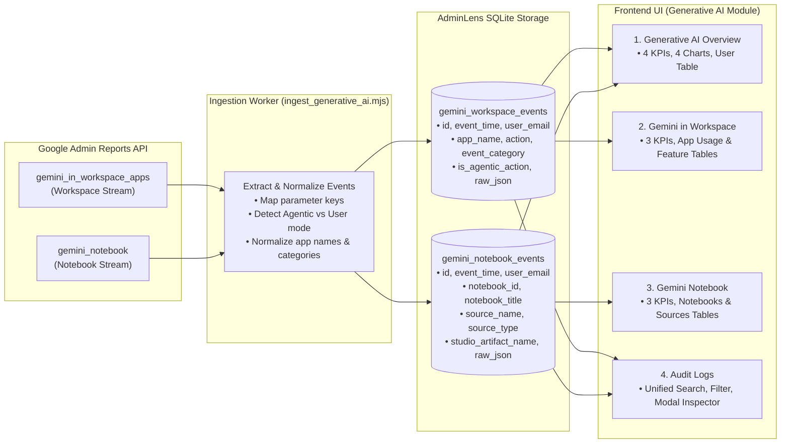

# Developer Guide: Generative AI Telemetry & Module Implementation

This document provides clear, concise specifications for developers building or maintaining the **Generative AI** telemetry ingestion pipelines, database schemas, and frontend views in AdminLens.

---

## 1. Google Workspace API Data Ingestion

Google Workspace provides audit activity through the **Google Admin SDK Reports API** (`reports_v1`).

### Scope Required
* `https://www.googleapis.com/auth/admin.reports.audit.readonly`
* Service Account authenticated with Domain-Wide Delegation acting as the Workspace Super Admin.

### API Endpoint & Method
```http
GET https://admin.googleapis.com/admin/reports/v1/activity/users/{userKey}/applications/{applicationName}
```
* **`userKey`**: `"all"` (to collect across all tenant user accounts).
* **`maxResults`**: `100` (paginated using `pageToken` and `nextPageToken`).

### Two Required `applicationName` Streams
AdminLens calls `reports.activities.list` for two distinct application streams:

| Stream Name (`applicationName`) | Description | Example Activity / Events Tracked |
| :--- | :--- | :--- |
| **`gemini_in_workspace_apps`** | User prompts and automated flows across standard Google Workspace applications. | Gemini Chat, Docs drafting, Gmail unread summary, Meet studio sound, Slides image generation, Workspace Studio background flows. |
| **`gemini_notebook`** | Grounded research projects, sources ingested, and artifacts created in NotebookLM / Gemini Notebook. | Project creation, PDF/URL/Doc upload, Audio Overview podcast generation, research note creation, visibility changes. |

---

## 2. Data Flow & Database Mapping Architecture

Below is the end-to-end data pipeline from Google Cloud to AdminLens SQLite storage and the frontend UI:



### SQLite Schema Reference
```sql
CREATE TABLE IF NOT EXISTS gemini_workspace_events (
    id TEXT PRIMARY KEY,
    event_time TEXT NOT NULL,
    user_email TEXT NOT NULL,
    is_agentic_action INTEGER DEFAULT 0,  -- 0 = User, 1 = Agentic / Studio Flow
    app_name TEXT,                       -- gemini_app, docs, gmail, slides, meet, etc.
    action TEXT,                         -- classic_use_case_*, summarize_unreads, etc.
    event_category TEXT,                 -- active_conversations, active_generate, inactive
    raw_json TEXT
);

CREATE TABLE IF NOT EXISTS gemini_notebook_events (
    id TEXT PRIMARY KEY,
    event_time TEXT NOT NULL,
    user_email TEXT NOT NULL,
    event_name TEXT NOT NULL,            -- create_notebook, add_source, generate_artifact
    notebook_id TEXT,
    notebook_title TEXT,
    notebook_visibility TEXT,            -- private or shared
    source_name TEXT,
    source_type TEXT,                    -- pdf, gdoc, url, text
    studio_artifact_name TEXT,           -- audio_overview, briefing_doc, study_guide
    raw_json TEXT
);
```

---

## 3. Frontend Pages: Charts & Tables Breakdown

The module is structured into 4 tabs accessible via `/?tab=<name>`:

### Tab 1: Overview (`?tab=overview`)
* **Page Header**: "Generative AI Overview"
* **Top Metric Cards (4)**: Total Activity Events, Active Users, Autonomous Actions (Studio flows), Gemini Notebook Projects.
* **Charts (2x2 Balanced Grid)**:
  1. **Generative AI Activity** *(Line/Area)*: Daily activity volume over time. Toggleable between "Workspace vs Gemini Notebook" and "User vs Agentic".
  2. **AI Activity by Application** *(Doughnut)*: Proportion of events across connected apps with total event count center-badge.
  3. **AI Capabilities & Tasks** *(Horizontal Bar)*: Workload distribution. Switchable between "Core Pillars" (Chat, Automation, Summarization, Media) and "Top Actions".
  4. **How AI Is Used** *(Stacked Bar)*: Engagement split (Conversations vs Content Gen vs Passive) and initiator mix (People vs Agents).
* **Table**: **User Activity** — Paginated leaderboard of accounts with live email search and column sorting (User, Workspace Events, Notebook Events, Total Events, Last Active).

### Tab 2: Gemini in Workspace (`?tab=apps`)
* **Page Header**: "Gemini in Workspace" (accompanied by the official 2025 Google Gemini icon).
* **Top Metric Cards (3)**: Total Events in Workspace, Execution Mode (User-initiated vs Automated flows), Top Workspace App.
* **Tables (2)**:
  1. **Application Usage**: Connected applications, event counts, visual "Share of Activity" progress bar, execution mode.
  2. **Application Features**: Granular user actions (e.g., summarize, story generation), event count, visual progress bar, category, and execution mode pill. Supports multi-column sorting.

### Tab 3: Gemini Notebook (`?tab=notebooks`)
* **Page Header**: "Gemini Notebook" (accompanied by the official Gemini Notebook logo).
* **Top Metric Cards (3)**: Total Notebooks (shared vs private), Ingested Sources (PDFs, URLs, Docs), Generated Studio Artifacts (Audio Overviews, Study Guides).
* **Tables (2)**:
  1. **Notebook Projects**: Project titles, owner email, creation date, visibility tag, and source counts.
  2. **Ingested Reference Sources**: File name, source type badge, attached notebook project, and ingestion timestamp.

### Tab 4: Audit Logs (`?tab=audit`)
* **Unified Audit Stream**: Merges `gemini_workspace_events` and `gemini_notebook_events` into a chronological table.
* **Filters & Controls**: App selector filter, Actor filter (All / User / Agentic), Engagement filter (Active / Inactive), and text search.
* **Inspection Modal**: Clicking any row displays the full event payload, category code, and raw Google API JSON.
