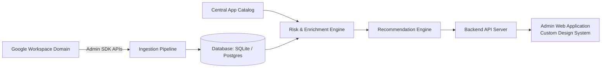
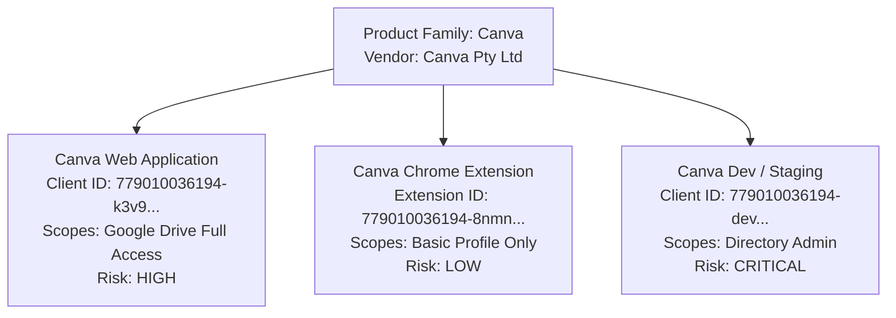

# AdminLens — System & Product Requirements Document (PRD)

| Metadata | Details |
| :--- | :--- |
| **Project** | AdminLens (Google Workspace OAuth Security & Governance) |
| **Document Version** | 1.1 (Template-Agnostic / Production Handover) |
| **Target Audience** | Core Engineering Team & Product Designers |
| **Companion Codebase** | GitHub Repository Root |
| **Documentation Goal** | High-level system requirements with direct codebase cross-references |

---

## 1. Executive Summary & Purpose

### 1.1 The Problem
When users sign in to third-party web apps or install Chrome extensions with their corporate Google accounts ("Sign in with Google"), they grant external companies access to corporate emails, files, and directory data. IT and Security administrators currently lack:
1. Complete visibility into which external apps have active data access.
2. An objective risk rating model (understanding if an app is safe or dangerous).
3. Automated policy enforcement to revoke, block, or approve apps across the organization.

### 1.2 The Solution
**AdminLens** connects to Google Workspace, ingests OAuth grant events, standardizes app identities into a centralized catalog, evaluates multi-layered security risks (on a clear 1.00 to 5.00 scale), and generates actionable administrative recommendations.



---

## 2. Core Architecture: Hierarchical Identity Model

> **Critical Design Principle**: Do NOT merge all Client IDs of a vendor into one single application record.

Enterprise vendors routinely operate multiple OAuth Client IDs across different platforms (for example: Web App, Chrome Extension, Android App, and Staging/Test environment).

### 2.1 The Two-Tier Model
1. **Tier 1: Canonical Product Family (`global_product_families`)**
   - Represents the vendor organization and brand identity.
   - Holds shared vendor data: Vendor Name, Domain, Brand Logo, Security Certifications (SOC 2, ISO 27001, GDPR), and Vendor Breach History.
2. **Tier 2: Distinct Platform Deployment (`global_app_deployments`)**
   - Represents the specific OAuth Client ID, Chrome Extension ID, or Mobile Package.
   - Holds technical permissions: Requested Scopes, Deployment Risk Score, and Active Status.



### 2.2 Why This Separation Is Required
* **Scope Differences**: A vendor's Chrome extension may only request user identity, while their cloud web application requests full read/write access to Google Drive.
* **Granular Policy Control**: Administrators often need to **TRUST** the web application while **BLOCKING** the browser extension.
* **Staging Detection**: Identifies abandoned developer or test client IDs that create security backdoors.

> **Codebase Reference for Claude**:
> * Architecture Specification: `CENTRAL_APP_REPOSITORY_ARCHITECTURE.md`
> * Catalog Standardization: `build_standardized_catalog.mjs`
> * Relational Schema: `schema.sql`

---

## 3. Data Ingestion Requirements

The system must support two data ingestion pipelines:

| Method | Source | Description | Frequency |
| :--- | :--- | :--- | :--- |
| **API Sync (Live)** | Google Admin SDK | Pulls audit logs and active tokens directly from Google APIs. | Daily / Scheduled Daemon |
| **CSV Import (Fallback)** | Google Admin Console Export | Ingests manually exported `owl_apps.csv` and `tokens.csv`. | On-demand file upload |

### 3.1 Google Admin SDK Integration Details
1. **Reports API (`applicationName=token`)**:
   - Ingests event logs: `authorize` (new grant), `revoke` (token removed), and `activity`.
   - Captures: user email, client ID, requested scope list, event timestamp, and IP address.
2. **Directory API (`users.tokens.list`)**:
   - Queries point-in-time active tokens for all domain users to build baseline state.

> **Codebase Reference for Claude**:
> * Google Auth Setup: `test_auth.mjs`
> * Audit Timeline Ingestion: `ingest_timeline_180d.mjs`
> * CSV Parser Script: `ingest_owl_apps_csv.mjs`

---

## 4. Multi-Layer Risk Scoring Engine

Risk is calculated on a standardized **1.00 (Lowest Risk) to 5.00 (Highest Threat)** scale:

```
[1.00 - 1.99] = LOW (Blue)
[2.00 - 2.99] = MEDIUM (Green)
[3.00 - 3.99] = HIGH (Orange)
[4.00 - 5.00] = CRITICAL (Red)
```

### 4.1 Layer 1: Scope Threat Classification (1–5)
Every Google OAuth scope is mapped to an enterprise threat rating:
* **Score 5 (Critical)**: Full Email access (`mail.google.com`) or Admin Directory control.
* **Score 4 (High)**: Full Google Drive Read/Write/Delete permissions (`drive`).
* **Score 3 (Medium)**: Calendars, Contacts, and Spreadsheets read/write.
* **Score 2 (Minor)**: Read-only educational or operational scopes (`classroom.courses.readonly`).
* **Score 1 (Low)**: Basic identity verification (`openid`, `profile`, `email`).

### 4.2 Layer 2: Inherent Application Risk ($R_{\text{inherent}}$)
Evaluates the application independently of tenant user counts:

$$R_{\text{inherent}} = \min\big(5.00, \; S_{\text{scope}} + \Delta_{\text{verification}} + \Delta_{\text{breach}}\big)$$

1. **Scope Sensitivity ($S_{\text{scope}}$)** uses the **Non-Compensatory Floor Model**:
   - The most dangerous scope sets the baseline: $\text{Base Floor} = \max(0, \text{Peak Scope} - 1)$
   - Minor breadth surcharge for excessive scopes: $\text{Breadth} = \text{Average Scope} \times 0.2$
   - $S_{\text{scope}} = 1.00 + \text{Base Floor} + \text{Breadth}$
2. **Publisher Verification Penalty ($\Delta_{\text{verification}}$)**:
   - Verified Google Partner / Marketplace App: `+0.00`
   - Unverified Publisher: `+0.35`
3. **Breach Recency Penalty ($\Delta_{\text{breach}}$)**:
   - No known security breach: `+0.00`
   - Breach older than 24 months: `+0.25`
   - Breach between 12 and 24 months ago: `+0.50`
   - Breach within the last 12 months: `+1.00`

### 4.3 Layer 3: Tenant Operational Risk
When an application is evaluated inside a specific customer domain, calculate contextual exposure:
* **Super Admin Consent**: High-privilege users granting access increases severity.
* **User Blast Radius**: Total number of accounts granting permissions.
* **Stale Tokens**: Tokens with no activity for > 90 days.

> **Codebase Reference for Claude**:
> * Risk Formula Specification: `APPLICATION_RISK_SCORING_METHODOLOGY.md`
> * Risk Calculation Script: `recalculate_all_applications.mjs`
> * Scope Lookup Matrix: `seed_scope_reference.mjs`
> * Breach Recency Logic: `breach_monitoring_service.mjs`

---

## 5. Policy & Recommendation Engine

The recommendation engine evaluates all application metadata against a deterministic Decision Tree to produce immediate action items:

| Action | Trigger Criteria | Recommended Remediation |
| :--- | :--- | :--- |
| **BLOCK** | Unverified app + Critical/High scope (Score $\ge 4.0$) + Unknown vendor | Add Client ID to Google Workspace Blocked List. |
| **REVOKE** | Inactive token (> 90 days) OR Staging/Dev environment detected | Revoke user tokens via Directory API. |
| **RESTRICT / LIMIT** | App requests broad scopes beyond its operational category | Restrict app access to specific Organizational Units (OUs). |
| **REVIEW** | Recent vendor breach reported OR Admin consented without SSO review | Assign to security team for compliance review. |
| **TRUST** | Google-verified publisher + SOC 2 certified + Low scope risk | Mark application as Approved/Trusted. |

> **Codebase Reference for Claude**:
> * Recommendation Logic: `recommendations_engine.mjs`
> * Decision Tree Diagram: `recommendations_decision_tree.svg`

---

## 6. Frontend Functional Requirements (Design Team Handover)

*(Note: The design team will supply their own custom template and design system. The engineering team must implement the following functional views, state management, and data contracts).*

### 6.1 View 1: Executive KPI Dashboard
* **Metrics Cards**:
  - Total Connected Applications.
  - Critical & High-Risk Apps Count.
  - Apps Authorized by Super Admins.
  - Stale / Dormant Tokens Count.
* **Risk Distribution Widget**: Visual count breakdown across Critical (Red), High (Orange), Medium (Yellow), and Low (Blue).
* **Sync Health Indicator**: Shows timestamp of last successful Google Workspace API sync.

### 6.2 View 2: Application Inventory Grid / Table
* **Search & Filters**:
  - Full-text search by App Name, Vendor, or Client ID.
  - Filter by Category, Risk Level, Verification Status, and Access Level (Trusted, Limited, Blocked).
* **Column Fields Required**:
  - App Name & High-Res Brand Icon.
  - Vendor & Publisher Domain.
  - Platform Deployment Badge (`Web App`, `Chrome Extension`, `Mobile`, `Internal Dev`).
  - Risk Level Badge with numerical score (e.g., `4.15 CRITICAL`).
  - Total Users & Admin Users count.
  - Current Policy Status (`TRUSTED`, `LIMITED`, `BLOCKED`, `UNCONFIGURED`).

### 6.3 View 3: Granular Application Detail (Drawer or Modal)
* **Scope Breakdown**: List of all requested Google OAuth scopes, displaying:
  - Technical Scope URL (e.g., `https://www.googleapis.com/auth/drive`).
  - Human-friendly description.
  - Severity level badge (Score 1 to 5).
* **Compliance & Trust Posture**:
  - Verification checkmark (Google Workspace Marketplace verified).
  - Listed certifications (e.g., SOC 2 Type II, ISO 27001, GDPR).
  - Known breach alerts and dates.
* **User Grant List**: Table of users who have authorized the app, showing email, Organizational Unit (OU), admin status, and last active timestamp.

### 6.4 View 4: Action & Policy Execution
* **Admin Actions**:
  - **Trust / Approve**: Update access level to `TRUSTED`.
  - **Limit by OU**: Configure allowed Organizational Units.
  - **Revoke Tokens**: Trigger bulk revocation for selected users or the entire app.
  - **Block App**: Set policy to `BLOCKED` across the Google Workspace domain.

> **Codebase Reference for Claude**:
> * Backend API Routes & Data Schemas: `server.mjs`

---

## 7. Codebase Directory & File Reference Index

Developers can direct Claude to analyze the existing proof-of-concept scripts using this file map:

```
adminlens-investigation/
├── schema.sql                           # Database Schema (Applications, Deployments, Grants, Scopes)
├── build_standardized_catalog.mjs       # Product Family & Deployment normalization logic
├── recommendations_engine.mjs           # Decision Tree logic for automated admin recommendations
├── recalculate_all_applications.mjs     # 1.00 - 5.00 Risk Scoring mathematical engine
├── seed_scope_reference.mjs             # Matrix of 100+ Google OAuth scopes with 1-5 threat scores
├── breach_monitoring_service.mjs        # Security breach history scoring and penalties
├── app_enrichment_service.mjs           # Vendor metadata, categories, and certifications
├── ingest_owl_apps_csv.mjs              # Parser for Google Admin Console CSV exports
├── ingest_timeline_180d.mjs             # Ingestion service for Google Reports API audit events
└── server.mjs                           # REST API server serving apps, risks, and recommendations
```

---

## 8. Definition of Done (DoD) for Implementation

1. **Database Consistency**: Target database schema matches the relational model in `schema.sql`.
2. **Two-Tier Identity**: No Client ID is stored without an associated `global_product_families` parent.
3. **Scoring Parity**: Calculated app risk scores match `recalculate_all_applications.mjs` within a 0.01 margin of error.
4. **Recommendation Accuracy**: The recommendation engine correctly flags test scenarios (e.g., blocking unverified high-scope apps, revoking staging tokens).
5. **API Contract Completeness**: The backend provides all endpoints needed to populate the design team's frontend dashboard components.
